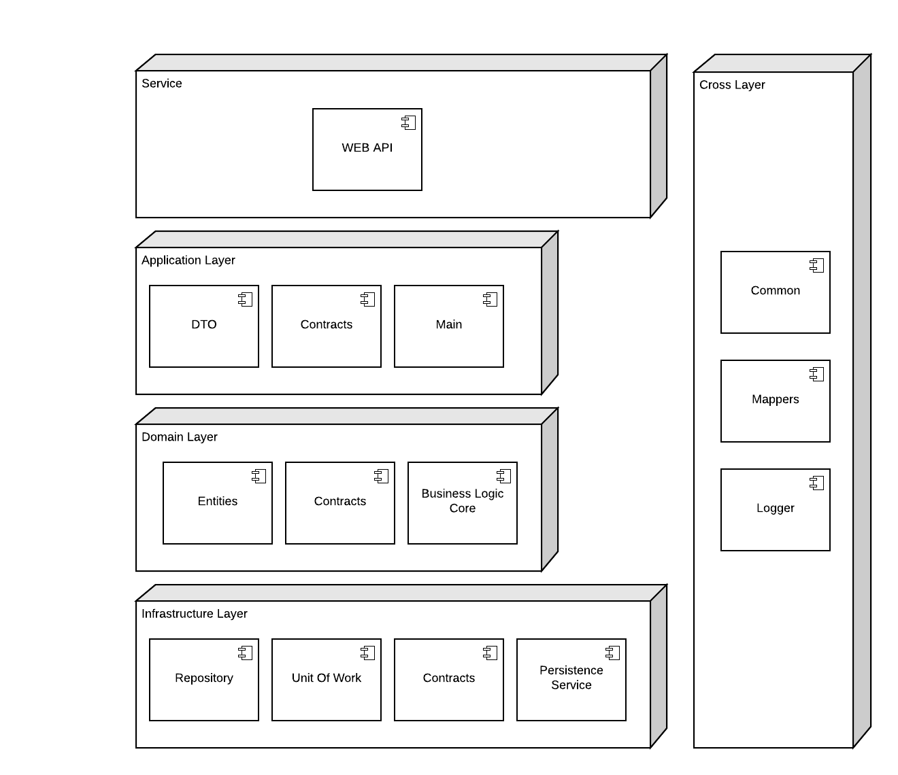

# DDD N-Layer Service .Net Core

## Architecture

## Layer Technologies

### Infrastructure

-   NetStandard.Library
-   Micro ORM Dapper
-   Microsoft.Extension.Configuration
-   System.Data.SqlClient

### Domain Layer

-   NetStandard.Configuration
-   AutoMapper

### Services

-   Microsoft.AspNetCore.App
-   Microsoft.NetCore.App
-   AutoMapper
-   AutoMapper.Extensions.Microsoft.DependencyInjection
-   Swashbuckle.AspNetCore (Swagger)
-   System.IdentityModel.Tokens.Jwt (JWT)

### Cross Cutting Layer

-   NetStandard.Library
-   AutoMapper
